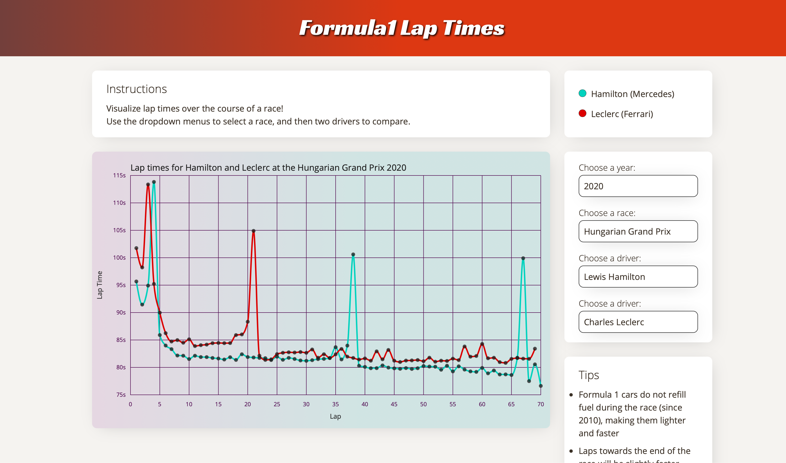

# Formula1 lap times

[Live Link](https://cris415.github.io/f1laptimes/)

In this Javascript project, users can compare lap times between two drivers in any race between 1996 to 2022. 

## Technology

F1 Lap times is built using HTML, CSS, JavaScript, and D3.js. D3.js is used to render the graph and import the dataset.

## Features

- Use the dropdown menus to select the year, race, and drivers
- The line graph will illustrate the lap times throughout the race
  - The line graph is animated to illustrate the race theme
  - Line colors correspond with team colors
- The race results will show a detailed chart of the race
  - The results table includes position, fastest lap time, fastest speed, status, and other driver information
- Tips panel to help the user read the graphs more clearly
- Race information panel with details of the race event, circuit, drivers, and teams 
